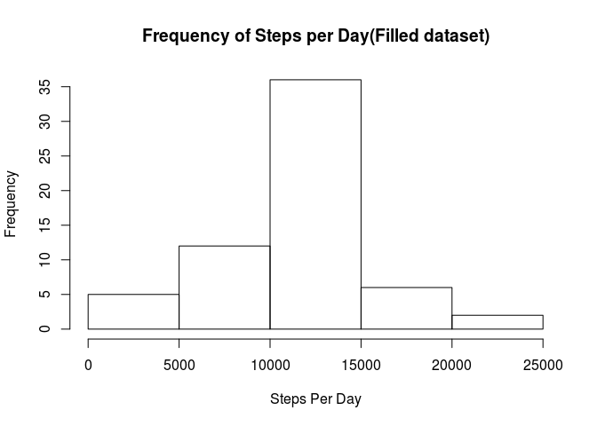

# Reproducible Research: Peer Assessment 1


## Loading and preprocessing the data

```r
unzip("activity.zip")
step_data <- read.csv("activity.csv")
```


## What is mean total number of steps taken per day?

```r
steps_per_day <- aggregate(step_data$steps~step_data$date, FUN=sum)
hist(steps_per_day[,2], main="Frequency of Steps per day", xlab="Steps Per Day")
```

 

```r
mean(steps_per_day[,2])
```

```
## [1] 10766.19
```

```r
median(steps_per_day[,2])
```

```
## [1] 10765
```

## What is the average daily activity pattern?


```r
interval_steps <- aggregate(step_data$steps ~ step_data$interval, FUN=mean)
plot(interval_steps[,1], interval_steps[,2], main="Average Steps by Interval", xlab = "Interval", 
     ylab = "Average Steps", type="l")
```

 

## Imputing missing values

```r
sum(is.na(step_data$steps))
```

```
## [1] 2304
```

```r
filled_data <- step_data
for (i in 1:nrow(interval_steps)){
    filled_data$steps[is.na(filled_data$steps) & 
    filled_data$interval == interval_steps[i, 1]] <- interval_steps[i, 2]
}

complete_steps_per_day <- aggregate(filled_data$steps~filled_data$date, FUN=sum)
hist(complete_steps_per_day[,2], main="Frequency of Steps per Day(Filled dataset)", xlab="Steps Per Day")
```

 

```r
mean(complete_steps_per_day[,2])
```

```
## [1] 10766.19
```

```r
median(complete_steps_per_day[,2])
```

```
## [1] 10766.19
```

## Are there differences in activity patterns between weekdays and weekends?

```r
weekend <- c("Saturday", "Sunday")
weekdays <- c("Monday", "Tuesday", "Wednesday", "Thursday", "Friday")
is_weekend <- function(dayofweek) {
    if (dayofweek %in% weekend){
        return("weekend")
    }
    else if (dayofweek %in% weekdays) {
        return("weekday")
    }
    else {
        return("NA")
    }
}
filled_data$part_of_week <- factor(sapply(weekdays(as.Date(filled_data$date)), 
                                          is_weekend, USE.NAMES = FALSE))
weekday_steps <- aggregate(filled_data$steps ~ filled_data$part_of_week + filled_data$interval, FUN=mean)
names(weekday_steps) <- c("part_of_week", "interval", "steps")
library(ggplot2)
g = ggplot(weekday_steps, aes(interval, steps, group = 1)) + 
    geom_line() +
    facet_grid(part_of_week ~ .) +
    labs(x = "Interval", y = "Average Steps", title = "Average Steps by Interval: Weekdays vs Weekends")
print(g)
```

 

